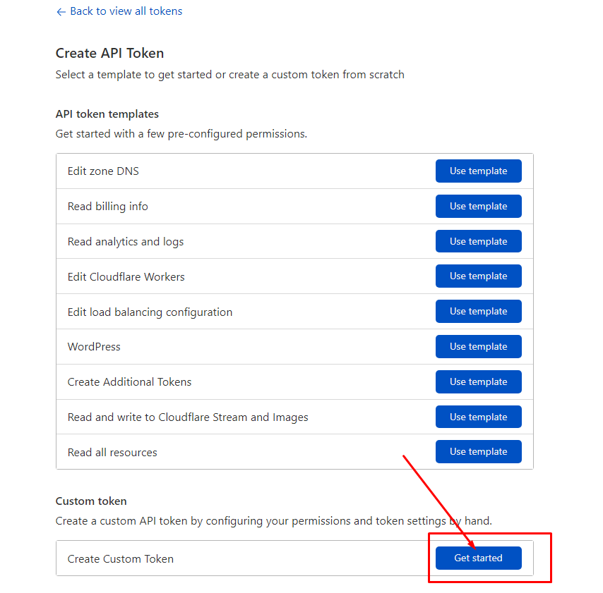
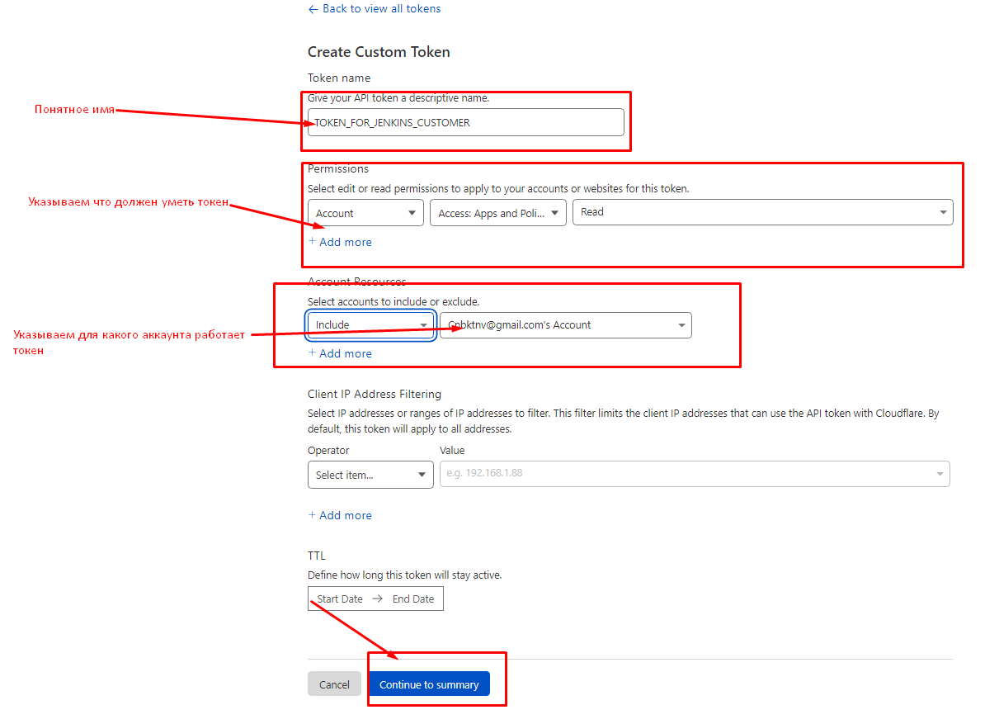
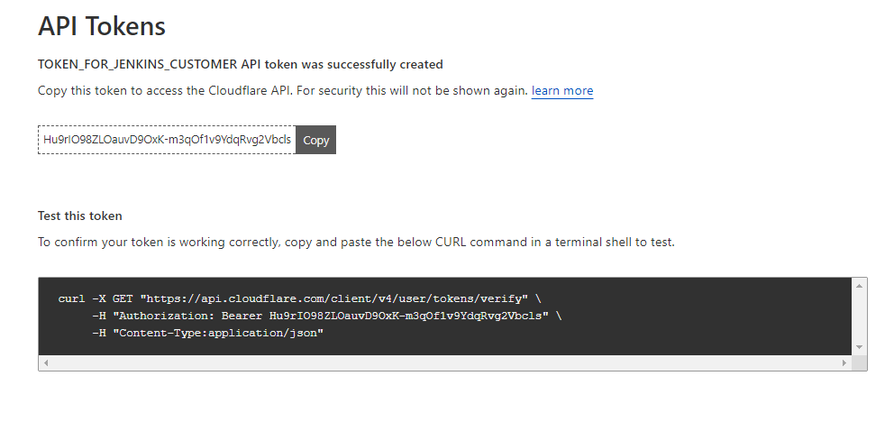
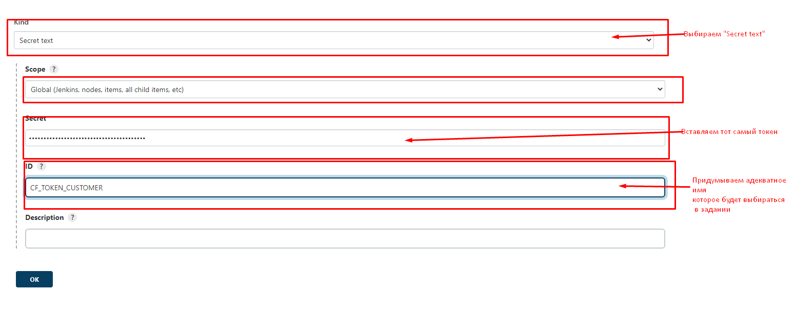

# API CloudFlare

## Как пользоваться:

Создана задача в Jenkins:
http://build.enterra.ln/job/Dev/job/CloudeFlafe/


## Как создать токен CloudFlare

Переходим в профиль пользователя - API Tokens
https://dash.cloudflare.com/profile/api-tokens
жмем кнопку "Create Token"


на открывшейся странице жмем "Get started"


минимальные настройки прав:


Жмем "Continue to summary", после чего откроется сводная информация по токену там жмем "Create Token"

на открывшейся странице копируем не посредственно сам токен и переходим в Jenkins для создания
Credentials
http://build.enterra.ln/user/{{account}}/credentials/


## Внутренняя кухня для DevOps

 Сам скрипт находиться в файле `cloudflare.py` 
 При вызове команды `cloudflare.py --help` выведит в консоль справочную информацию
 
 Создан `Dockerfile` с содержимым:
 
```commandline
FROM python:3.9.13-alpine3.16

MAINTAINER Alexandr Khramov  <Aleksandr.Khramov@enterra-inc.com>

ARG env_jenkins

RUN  mkdir /APP &&\
     python --version && pip --version &&\
     pip install --upgrade pip &&\
     pip install --upgrade setuptools &&\
     pip install click CloudFlare

COPY ./cloudflare.py /APP

WORKDIR /APP

ENTRYPOINT python /APP/cloudflare.py -j "$ENV_JENKINS"
```
 Основным процессом контейнера является собственно скрипт принимающий параметры, 
 которые нужно передать при запуске контейнера
 `docker run -i -e ENV_JENKINS=\"{'TOKEN': '${TOKEN_CF}', 'zone': '$i', 'ipaddress': '${ip_address}', 'mongol': 'false'}\" --rm  <<image_name>> `
 
 
